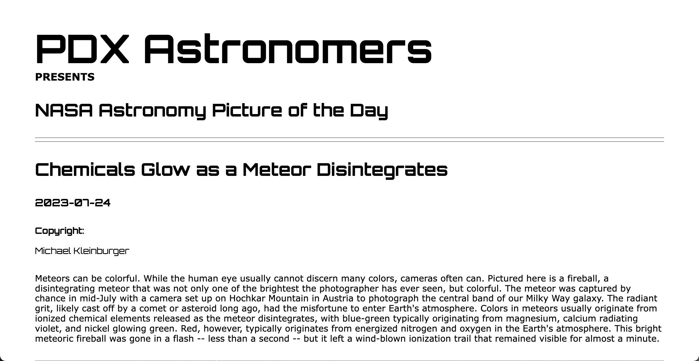

# PDX Astronomers
This is a site for PDX astronomers that calls on NASA's api for a the NASA picture of the day.

**Link to project:** https://pdxastronomers.netlify.app/

## How It's Made:

**Tech used:** HTML, CSS, Javascript

A basic fetch to NASA's api is called and some JSON data that is returned is displayed on the screen. The media type (image or video) along with a description, date that the picture of the day is from, and the copyright info is inputted into the display.

## Lessons Learned:

When working with external api's remember that every refresh will call and count to your daily count of times the api can be called.